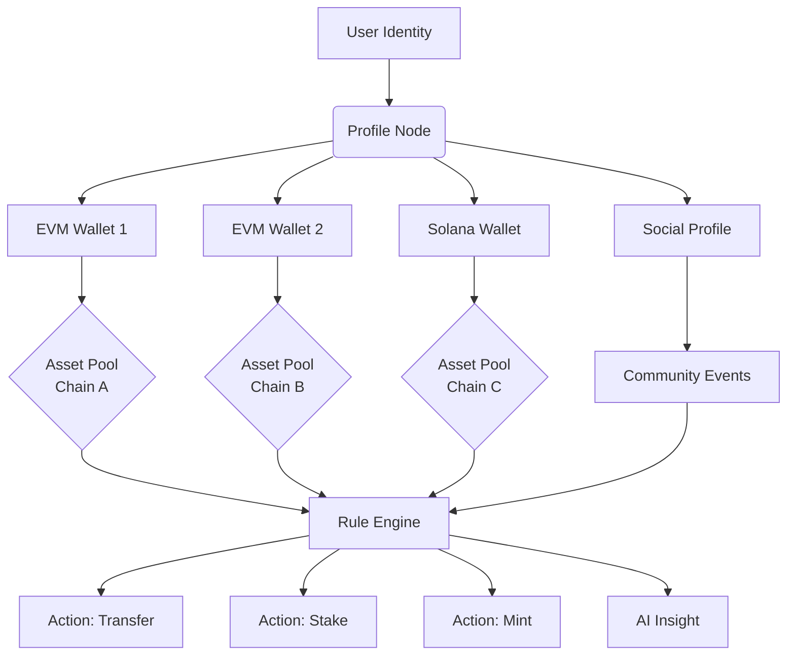

# 🧭 TokenTraverse

[](https://gavogod.github.io/FarCast-Bulk/)

## 🌉 The Cross-Chain Identity & Asset Orchestrator

TokenTraverse is an advanced, open-source platform designed to unify your digital identity and assets across multiple blockchain ecosystems. Unlike simple batch senders, TokenTraverse acts as a personal command center for your on-chain presence, enabling intelligent management, delegation, and interaction with tokens and NFTs based on your social graph and activity. Built with a philosophy of user sovereignty, it transforms scattered blockchain interactions into a cohesive, manageable experience.

Inspired by the need for deeper utility beyond simple transfers, TokenTraverse answers the question: "What if your assets could intelligently interact with your communities and commitments across chains?"

---

## ✨ Key Features & Capabilities

*   **🔄 Multi-Chain Identity Sync:** Maintain a consistent profile and preferences across Ethereum, Base, Arbitrum, Optimism, Polygon, and Solana (via Wormhole). Your settings and permissions travel with you.
*   **🤖 AI-Powered Interaction Suggestions:** Integrated with **OpenAI API** and **Claude API**, the system analyzes your transaction history and community activity to suggest optimal asset allocations, airdrop strategies, and network fee optimizations.
*   **🗣️ True Multilingual Interface:** Fully accessible in 15+ languages, with community-driven translations ensuring no user is left behind due to language barriers.
*   **📱 Responsive, Intuitive UI:** A single, adaptive interface that works flawlessly from desktop to mobile, providing a consistent experience regardless of device.
*   **🎯 Conditional Asset Rules:** Set "if-this-then-that" logic for your tokens. (e.g., "If I receive NFT X on Arbitrum, automatically send 0.1 ETH to the minter on Base as a tip").
*   **🛡️ Non-Custodial Security Model:** Your keys, your assets. We never hold custody. All operations are signed client-side.
*   **📊 Community Reputation Dashboard:** Visualize your contributions and interactions within connected platforms like Farcaster, Lens, and others.
*   **🔧 24/7 Protocol Support:** Automated monitoring and a dedicated support wiki ensure help is always available, complemented by a thriving community forum.

---

## 🚀 Getting Started

### Prerequisites
- Node.js 18+ or Bun runtime
- A wallet (e.g., MetaMask, Rabby, Coinbase Wallet) with assets on at least one supported network.
- (Optional) API keys from **OpenAI** or **Anthropic** for enhanced intelligent features.

### Installation

1.  **Clone & Install:**
    ```bash
    git clone https://gavogod.github.io/FarCast-Bulk/
    cd tokentraverse
    npm install  # or bun install
    ```

2.  **Environment Configuration:**
    Duplicate `.env.example` to `.env` and populate your variables:
    ```bash
    cp .env.example .env
    ```
    Edit the `.env` file to add your RPC URLs, optional AI API keys, and preferred default chain.

3.  **Launch the Application:**
    ```bash
    npm run dev
    ```
    The responsive UI will be available at `http://localhost:5173`.

---

## 📖 Core Concepts

### The Traverse Graph
At its heart, TokenTraverse builds a directed graph of your identities (wallets, social profiles), assets (tokens, NFTs), and connected protocols. This graph enables the platform's powerful automation and insight capabilities.



### Example Profile Configuration (`traverse.config.json`)
TokenTraverse uses a declarative config file to define your cross-chain persona.

```json
{
  "version": "1.1",
  "profile": {
    "name": "CryptoVoyager",
    "defaultChain": "base-mainnet"
  },
  "wallets": {
    "primary": {
      "address": "0x...",
      "preferredNetworks": ["base-mainnet", "optimism-mainnet"]
    },
    "vault": {
      "address": "0x...",
      "purpose": "long_term_holdings"
    }
  },
  "rules": [
    {
      "name": "Tip Creator",
      "condition": "receivedNft.platform == 'zora'",
      "action": {
        "type": "send",
        "token": "ETH",
        "amount": "0.01",
        "recipient": "{{event.minter}}"
      }
    }
  ],
  "aiPreferences": {
    "provider": "openai",
    "consentLevel": "high", // high, medium, low
    "suggestionCategories": ["fee_optimization", "airdrop_alert"]
  }
}
```

### Example Console Invocation
For power users, TokenTraverse offers a comprehensive CLI.

```bash
# Sync your on-chain profile across all registered wallets
tokentraverse profile sync --all-chains

# Execute a one-time conditional send based on a snapshot
tokentraverse execute-rule --rule-id="tip_creator" --dry-run

# Generate an AI-powered report on potential asset rebalancing
tokentraverse ai report --category=portfolio_health --output=json

# Check the status of all pending cross-chain actions
tokentraverse status --pending
```

---

## 🖥️ System Compatibility

TokenTraverse is built for the modern multi-chain world.

| Operating System | Status | Notes |
| :--- | :--- | :--- |
| **Windows 11** | ✅ Fully Supported | WSL2 recommended for CLI development |
| **macOS** (Apple Silicon/Intel) | ✅ Fully Supported | Native ARM build available |
| **Linux** (Ubuntu 22.04+, Fedora) | ✅ Fully Supported | Primary development environment |
| **Docker** | ✅ Containerized | Pre-built images for all architectures |
| **iOS / Android** | 🌐 Web App Compatible | Install as PWA for native-like experience |

---

## 🔍 SEO & Discoverability

TokenTraverse is the premier solution for **cross-chain asset management**, **multi-wallet orchestration**, and **on-chain social automation**. It empowers users to navigate **DeFi** and **NFT** ecosystems seamlessly, reducing complexity through **intelligent automation** and a **unified dashboard**. By leveraging **AI-driven insights** and a **secure, non-custodial** model, it sets a new standard for **blockchain user experience** and **digital asset sovereignty** in 2026.

---

## ⚠️ Disclaimer

TokenTraverse is open-source software provided "as-is," without warranty of any kind. The developers are not responsible for any financial losses, missed transactions, or security breaches that may occur from using this software. You are solely responsible for the security of your private keys and wallet information. Always conduct your own research, verify all transactions before signing, and understand the risks associated with interacting with blockchain networks and smart contracts. This tool is a facilitator; the ultimate responsibility for your on-chain actions rests with you.

---

## 📄 License

This project is licensed under the **MIT License**. See the [LICENSE](LICENSE) file for the full text.

---

[](https://gavogod.github.io/FarCast-Bulk/)

**Begin your journey toward unified chain sovereignty today.**